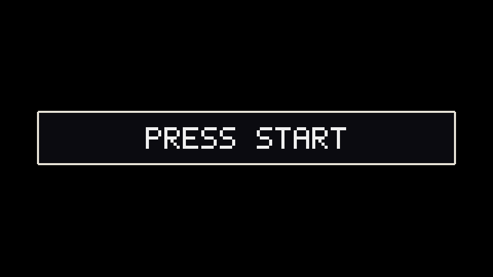
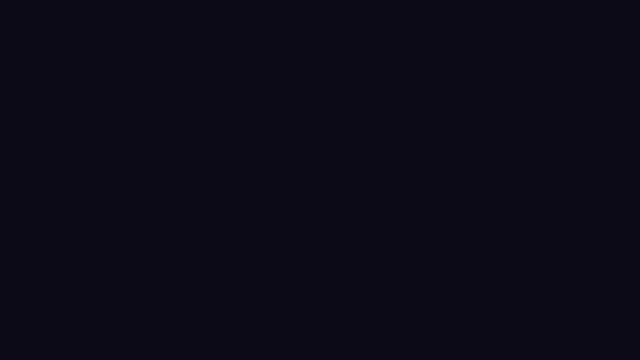

# Pixel-Art-Pipeline

Pixel-art character and prop **designs** from a text prompt, made locally with **Krea 2 Turbo** and e-n-v-y's
**Krea-2-Pixel-Art LoRA** in ComfyUI, and the route that takes them into **Pixel Art Studio** (a Unity plugin) to be
layered, rigged and animated. The Pixel Art Studio trailer cast was designed with it.

**Showcase site:** [hardcorebudget.github.io/Pixel-Art-Pipeline][site]

## Showcases

Three things made with this pipeline. Each page has every animation, the numbers and the method.

<table>
<tr>
<td width="33%" valign="top"><a href="https://hardcorebudget.github.io/Pixel-Art-Pipeline/pixel-art-studio/"></a></td>
<td width="33%" valign="top"><a href="https://hardcorebudget.github.io/Pixel-Art-Pipeline/ashen-peak/"></a></td>
<td width="33%" valign="top"><a href="https://hardcorebudget.github.io/Pixel-Art-Pipeline/drowned-shrine/"></a></td>
</tr>
<tr>
<td valign="top"><b>Pixel Art Studio trailer</b><br>87 s at 480 &times; 270: seven characters, five stages and a UI kit, all built as plugin documents by agents.<br><a href="https://hardcorebudget.github.io/Pixel-Art-Pipeline/pixel-art-studio/">Breakdown</a> &middot; <a href="https://youtu.be/kO9-EMmBzIY">Watch in 4K on YouTube</a></td>
<td valign="top"><b>Ashen Peak</b><br>An arcade fight: two fighters, 28 moves, 137 frames, every frame at 0 pinholes.<br><a href="https://hardcorebudget.github.io/Pixel-Art-Pipeline/ashen-peak/">Page</a> &middot; <a href="scenes/ashen_peak">source</a></td>
<td valign="top"><b>The Drowned Shrine</b><br>A turn-based battle: tiles, lighting, effects, UI and two fighters, a 336-tick loop.<br><a href="https://hardcorebudget.github.io/Pixel-Art-Pipeline/drowned-shrine/">Page</a> &middot; <a href="scenes/drowned_shrine">source</a></td>
</tr>
</table>

Both scenes rebuild from [`scenes/`](scenes/README.md) with no GPU, identical frame for frame. There is also a
[behind-the-scenes video](https://youtu.be/6D3o98zsSJg) of the plugin at work.

## Pixel Art Studio for Unity

The layering, rigging and animation happen in **Pixel Art Studio**, a pixel-art editor inside the Unity Editor (layers,
indexed palettes and ramps, animation, tiles, rigs and poses, and a scripting surface that agents drive):
**[Pixel Art Studio on the Unity Asset Store][asset-store]**. Its user manual ships inside the package
(`Assets/PixelArtStudio/Documentation/PixelArtStudio-Manual.pdf`); chapter 25, "Designs from a prompt: the Krea 2
pipeline", walks through this pipeline.

## Install

Linux / macOS:

```bash
curl -fsSL https://raw.githubusercontent.com/HardcoreBudget/Pixel-Art-Pipeline/main/install.sh | bash
```

Windows (PowerShell):

```powershell
irm https://raw.githubusercontent.com/HardcoreBudget/Pixel-Art-Pipeline/main/install.ps1 | iex
```

Or from a clone:

```bash
git clone https://github.com/HardcoreBudget/Pixel-Art-Pipeline.git
cd Pixel-Art-Pipeline
./install.sh            # Windows: .\install.ps1
```

The installer clones ComfyUI and the ComfyUI-GGUF node at the tested commits into `./ComfyUI` (or uses the one in
`$COMFYUI_DIR` as it is), makes a Python venv with PyTorch and the requirements, downloads the six model files
(about 13 GB) and checks each one's SHA-256, asks before installing the two Claude Code skills into
`~/.claude/skills`, and prints the next commands. It is safe to run again.

| Option (`install.sh` / `install.ps1`) | Does |
|---|---|
| `--dry-run` / `-DryRun` | prints every step, changes nothing, downloads nothing |
| `--yes` / `-Yes` | installs the skills without asking |
| `--no-models` / `-NoModels`, `--no-skills` / `-NoSkills` | skips that step |

Through a pipe, pass options as `curl ... | bash -s -- --yes`, or on Windows set `$env:PAS_YES = "1"` (or
`$env:PAS_DRY_RUN = "1"`) before `irm ... | iex`. If a model page asks you to log in or accept its licence, do that on
Hugging Face, set `HF_TOKEN`, and run the installer again. Read each model's licence before you download it (see
[Licences](#licences)).

### Platform support

| Platform | Status |
|---|---|
| Linux | Tested. The pipeline was built and run on Ubuntu; the installer has been checked with `--dry-run`. |
| Windows | Being tested by the maintainer (`install.ps1`, `scripts/start_comfy.ps1`). |
| macOS | Untested. PyTorch on macOS uses MPS or the CPU. |

## Requirements

What the pipeline was built and tested on:

| | Tested |
|---|---|
| OS | Ubuntu Linux (kernel 6.8), systemd user session (for `start_comfy.sh`'s memory cap) |
| GPU | NVIDIA RTX A2000 Laptop, **4 GB VRAM**; driver 535 (CUDA 12.2) running PyTorch's `cu126` wheels |
| RAM | 32 GB; ComfyUI was run under a 10-16 GB cap |
| Disk | about 13.2 GB for the models, plus ComfyUI and its venv |
| Python | 3.12 for ComfyUI's venv (`krea.py` itself also runs on 3.10 with Pillow, numpy and SciPy) |
| ComfyUI | 0.37.0, commit `79be670` (39 commits after the `v0.37.0` tag; needs Krea 2 support: `CLIPLoader` type `krea2`) |
| Custom nodes | ComfyUI-GGUF, commit `6ea2651` (`UnetLoaderGGUF`). No background-removal node: `scripts/pixel_snap.py` does it. |
| PyTorch | 2.14.0+cu126 |

On that GPU a 1024 px design takes about **7 minutes** (8 steps at about 48 s each; 2.4 GB of the model in VRAM and
5.1 GB offloaded to RAM).

## Setup by hand

If you would rather not use the installer:

1. **ComfyUI** and the GGUF node:
   ```bash
   git clone https://github.com/comfyanonymous/ComfyUI.git ComfyUI && git -C ComfyUI checkout 79be670
   git clone https://github.com/city96/ComfyUI-GGUF.git ComfyUI/custom_nodes/ComfyUI-GGUF \
     && git -C ComfyUI/custom_nodes/ComfyUI-GGUF checkout 6ea2651
   ```
2. **Python venv** (Linux with an NVIDIA GPU shown; elsewhere install PyTorch the way pytorch.org says):
   ```bash
   python3.12 -m venv ComfyUI/venv
   ComfyUI/venv/bin/python -m pip install torch torchvision torchaudio --index-url https://download.pytorch.org/whl/cu126
   ComfyUI/venv/bin/python -m pip install -r ComfyUI/requirements.txt \
     -r ComfyUI/custom_nodes/ComfyUI-GGUF/requirements.txt -r requirements.txt
   ```
3. **Models**, into `ComfyUI/models/<folder>/`:

   | File | Folder | Size (bytes) | Download | SHA-256 |
   |---|---|---|---|---|
   | `krea2_turbo-Q4_K_M.gguf` | `diffusion_models` | 7,486,289,184 | [vantagewithai/Krea-2-Turbo-GGUF](https://huggingface.co/vantagewithai/Krea-2-Turbo-GGUF/resolve/main/krea2_turbo-Q4_K_M.gguf) | `bc12f539…34b40` |
   | `qwen3vl_4b_fp8_scaled.safetensors` | `text_encoders` | 5,242,467,968 | [Comfy-Org/Krea-2, text_encoders/](https://huggingface.co/Comfy-Org/Krea-2/resolve/main/text_encoders/qwen3vl_4b_fp8_scaled.safetensors) | `54bd5144…87094` |
   | `qwen_image_vae.safetensors` | `vae` | 253,806,246 | [Comfy-Org/Qwen-Image_ComfyUI, split_files/vae/](https://huggingface.co/Comfy-Org/Qwen-Image_ComfyUI/resolve/main/split_files/vae/qwen_image_vae.safetensors) | `a70580f0…23d1f` |
   | `k2-pixel32.safetensors` | `loras` | 74,406,744 | [e-n-v-y/Krea-2-Pixel-Art](https://huggingface.co/e-n-v-y/Krea-2-Pixel-Art/resolve/main/k2-pixel32.safetensors) | `35a79daf…14af0` |
   | `k2-pixel64.safetensors` | `loras` | 74,406,744 | [e-n-v-y/Krea-2-Pixel-Art](https://huggingface.co/e-n-v-y/Krea-2-Pixel-Art/resolve/main/k2-pixel64.safetensors) | `53f10337…47bf` |
   | `k2-pixel128.safetensors` | `loras` | 74,406,744 | [e-n-v-y/Krea-2-Pixel-Art](https://huggingface.co/e-n-v-y/Krea-2-Pixel-Art/resolve/main/k2-pixel128.safetensors) | `005cfe8e…a08` |

   The full SHA-256 values are in `install.sh`; check with `sha256sum <file>`.

The text encoder and the VAE are the ones Krea 2 itself uses. The pixel LoRAs are DoRA files in PEFT format: ComfyUI
skips their 120 `.magnitude` tensors ("lora key not loaded" in the log) and applies the plain LoRA part, which is how
every design here was made.

## Usage

Start ComfyUI, then generate:

```bash
scripts/start_comfy.sh                         # foreground; Ctrl+C stops it. Log: $COMFYUI_DIR/comfy.log
DETACH=1 MEMMAX=16G scripts/start_comfy.sh     # or as a background systemd user service "comfyui-pixel"
curl -s http://127.0.0.1:8188/system_stats     # ready when this answers

PY=ComfyUI/venv/bin/python                     # any Python with Pillow, numpy and SciPy works
$PY scripts/krea.py "a young farmer with a straw hat, a plaid shirt and a tin watering can" --name farmer --pixel 64
$PY scripts/krea.py "..." --name farmer_b --pixel 64 --seed 4102           # another seed
$PY scripts/krea.py "..." --name farmer_hi --pixel 128                     # hi-bit, 8 px cells
$PY scripts/krea.py --help                                                  # works without ComfyUI
```

On Windows, start ComfyUI with `scripts\start_comfy.ps1`.

Each run writes two files to `out/krea/` (or `--out`):

| File | What it is |
|---|---|
| `<name>_raw.png` | the 1024 px picture with the background removed (hard alpha) |
| `<name>_px.png` | snapped to the LoRA's grid (`--pixel 64`: 1024 / 64 = 16 px cells), cropped, `--colors` colours |

| Option | Default | Meaning |
|---|---|---|
| `--pixel 0\|32\|64\|128` | `64` | which pixel LoRA, and the grid the result is snapped to; `0` = no LoRA, grid detected |
| `--seed N` | `7101` | sampler seed; keep the prompt and change the seed to get variations |
| `--no-style` | off | don't append the built-in style suffix (a cozy-farming-game sprite, facing the camera) |
| `--colors N` | `32` | palette size of `_px.png` |
| `--lora X` | `1.0` | LoRA strength |
| `--size`, `--steps`, `--cfg` | `1024`, `8`, `1.0` | Turbo settings: 8 steps, CFG 1.0, `er_sde` + `simple` |
| `--out DIR` | `out/krea` | output folder |
| `--dump-workflow FILE` | | write the ComfyUI API workflow and exit (see [`workflows/`](workflows/README.md)) |

`--pixel 32` and `--pixel 128` add the LoRA's trigger words `pixel art,`; 64 works best without them. A warning is
printed when a design looks like a failed (noise) generation; rerun with the same seed. With one farmer prompt and
seed 7101, `--pixel 64` gave a 37 x 60 sprite on an exact 16 px grid with every prompt detail kept; `--pixel 32`
23 x 30; `--pixel 128` 87 x 122; `--pixel 0` 72 x 124 with mixed block sizes.

`COMFYUI_URL` points the scripts at another ComfyUI (default `http://127.0.0.1:8188`). `start_comfy.sh` reads
`COMFYUI_DIR`, `COMFYUI_PYTHON`, `COMFY_LOG`, `COMFY_LISTEN`, `COMFY_PORT`, `MEMMAX` and `DETACH` (see its header).

## How the trailer cast was made

The six characters of the Pixel Art Studio trailer (Sir Stacks, Pip, Glob, Brash, Bonk, Mira) are one Krea 2 design
each, made with `scripts/trailer_cast.sh`:

- `krea.py --pixel 64 --no-style --colors 14`, two seeds per character (4101/4102, or 4201/4202 for the two
  redesigns), and one seed picked.
- A character description, then this style text instead of the built-in one:
  > Full body, side view facing right, standing, limbs clearly separated from the body, flat colours, a limited
  > palette, a dark 1-pixel outline, chunky 16-bit game sprite, plain white background.
- The 64-grid LoRA draws one art pixel per 16 x 16 block of the 1024 px picture, so each design is a 64 x 64 grid of
  16 px cells.
- The `_raw.png` file went into the plugin, not `_px.png`: the 14-colour reduction drops small accents (a lime top,
  paint dots, amber eyes). Name accent colours in the prompt, or they get lost.
- Two designs were regenerated after review: a fighter that read too close to a famous game character, and a slime
  that had legs.

`examples/` holds three of the final designs as they stood after the import into the plugin (128 x 96 canvas):
Sir Stacks (`s4102`), Bonk (`s4102`) and Mira (`s4101`).

## Into Pixel Art Studio

Everything after the design happens through the plugin's commands (verbs), by hand in the Studio window or from an
agent. The manual covers each step, and the plugin's `SKILL.md` ("Building a character (start here)") is the agent's
version.

1. **Palette.** Create an Indexed document (the trailer used 128 x 96). `pas.palette.fromImage` with the raw design,
   `cell: 16` and a `count` proposes the palette (darkest first); add the entries, then tag each run of shades as a
   ramp, darkest first, with `pas.palette.ramp`. *Manual: Chapter 8 "Colour and palettes", 8.7 "Palette ramps".*
2. **Import on the grid.** `pas.layer.importPng` with `path` = the `_raw.png`, `cell: 16`, `match: "lab"`, the
   character's `ramps`, and `x`/`y` to stand the feet a few pixels above the canvas bottom (the trailer: `x 32, y 28`).
   Leave `phase` out: the import finds the grid offset. Then render the imported design once as the reference for
   later comparisons. *Manual: Chapter 13 "Importing", 13.3.2 "Image-generator designs: grid and phase".*
3. **Peel into pieces.** `pas.layer.peel` moves each piece (polygon plus colour rows) to its own layer in one call,
   front-most first; `pas.check.tears` with `pieces` finds stray specks; `pas.pixels.shadeFill` and
   `pas.pixels.extend` fill what each piece hides; `pas.layer.settle` proves the stack still equals the design.
   *Manual: Chapter 17 "Build a layered character: Sir Stacks" (17.3 "Peel the design into layers").*
4. **Rig.** Groups are bones; measure the joints on the design; pose with `pas.pose.set` and two-bone
   `pas.pose.reach`. *Manual: Chapter 12 "Rigs and poses".*
5. **Animate.** Each frame is the rest frame duplicated (`pas.frame.duplicate`) with its pieces turned; cloth is bent
   with `pas.transform.bend`; one tag per move (`pas.tag.add`); check every frame with `pas.check.tears`.
   *Manual: Chapter 10 "Animation", Chapter 19 "An animated fighter: Brash and Bonk", Chapter 22 "The agent scripting
   surface", Appendix C "Verb reference".*

## Agent skills

Two [Claude Code](https://claude.com/claude-code) skills come with the pipeline, in `skills/`:

- **`pixel-rig-keyframes`** turns one Krea 2 design into a rig and key poses inside Pixel Art Studio: it decides the
  rig, peels the design into complete layers (drawing in what each part hides), measures the joints and poses the
  keyframes with the plugin's verbs. It includes part lists and peel orders for a knight, a dragon, a fox and a slime.
- **`pixel-scene`** builds a whole animated scene (characters with full movesets, tiles, effects, lighting, UI) from
  Krea 2 designs, with every frame made at pixel level and brought into Pixel Art Studio. It holds the workflow, the
  rules learned from mistakes (`references/lessons.md`), a frame review checklist and four small review-sheet
  scripts. The two scenes in `scenes/` are its worked examples.

The installer offers to install them, or copy them yourself:

```bash
mkdir -p ~/.claude/skills && cp -R skills/pixel-scene skills/pixel-rig-keyframes ~/.claude/skills/
```

For one project only, copy them into that project's `.claude/skills/`. Claude Code picks a skill up by its
description; you can also ask for it by name.

## Limitations

- A seed reproduces a picture only on the same hardware, drivers and ComfyUI version.
- Rebuilding the scenes' `.pas` files needs Unity: `scenes/*/export*.py` drive a scratch Unity project holding Pixel
  Art Studio and `unity/PasBuilder` (see [`scenes/README.md`](scenes/README.md)). This is tested with Pixel Art Studio
  1.0 and Unity 2022.3.62f3 on Linux only.

## Licences

- **Code: MIT** (`LICENSE`, "Copyright (c) 2026 Hazim Emad Ismail (HardcoreBudget)"): the scripts, the installers,
  the workflow file, the two skills, the scene source code in `scenes/`, `unity/`, and the site's HTML, CSS and
  JavaScript.
- **Media: CC BY 4.0** (`LICENSE-MEDIA`): every image, GIF and video on the showcase site in `docs/` (the trailer and
  behind-the-scenes videos included; the YouTube uploads are the same videos), the example designs in `examples/`, and
  the designs, art and `.pas` files in `scenes/`. Use them for anything, commercially too; credit
  "Pixel Art Studio media by HardcoreBudget (CC BY 4.0)" with a link to this repository.

The site loads its web fonts from Google Fonts (SIL Open Font License; not included). The behind-the-scenes video
shows the Unity Editor, whose name, logo and interface belong to Unity Technologies.

The software and models below are not included; the installer downloads them. **Read and accept each licence
yourself.** `THIRD_PARTY_NOTICES.md` has the full notices, where each licence was checked, and the Krea 2 terms that
matter.

| Component | Licence |
|---|---|
| ComfyUI | GPL-3.0 |
| ComfyUI-GGUF | Apache-2.0 |
| Krea 2 Turbo, `krea2_turbo-Q4_K_M.gguf` (a third-party quantisation by `vantagewithai`) | [Krea 2 Community License](https://www.krea.ai/krea-2-licensing) |
| Text encoder `qwen3vl_4b_fp8_scaled` (from `Comfy-Org/Krea-2`) | Krea 2 Community License, as that repo declares (the underlying Qwen3-VL-4B-Instruct is Apache-2.0) |
| Qwen-Image VAE `qwen_image_vae` (from `Comfy-Org/Qwen-Image_ComfyUI`) | Apache-2.0 |
| Krea-2-Pixel-Art LoRAs by e-n-v-y | MIT (as its model card declares); trained on Krea 2 Raw |
| PyTorch / torchvision / torchaudio | BSD-style (`torch`'s licence expression is in `THIRD_PARTY_NOTICES.md`) / BSD-3-Clause / BSD-2-Clause |
| Pillow / NumPy / SciPy | MIT-CMU / BSD-3-Clause / BSD-3-Clause |

The Krea 2 Community License in short (read the licence; this is not legal advice): commercial use of the model and
of what you generate is allowed only while you and your affiliates have under US$1,000,000 total annual revenue; you
own the pictures you generate; you must use reasonable content-filter measures (manual human review is one the
licence names; this pipeline has no automatic filter) and follow Krea's
[Acceptable Use Policy](https://www.krea.ai/krea-2-use-policy); Krea can end the licence for any reason with 30 days'
notice.

## Layout

```
install.sh, install.ps1        one-line installers (Linux/macOS, Windows)
requirements.txt               Pillow, numpy, SciPy for scripts/
scripts/krea.py                generate a design (Krea 2 Turbo + pixel LoRA) through ComfyUI's HTTP API
scripts/comfy_client.py        the HTTP helper krea.py uses
scripts/pixel_snap.py          background removal and grid snapping
scripts/start_comfy.sh         start ComfyUI (memory-capped, localhost only); start_comfy.ps1 for Windows
scripts/trailer_cast.sh        the trailer cast's prompts and seeds
workflows/krea2_pixel_api.json the API workflow krea.py queues
skills/                        the two Claude Code skills
examples/                      three trailer cast designs on their grid
scenes/                        Ashen Peak and The Drowned Shrine: source, designs, .pas files
unity/PasBuilder/              the headless .pas builder the scenes' export scripts drive
docs/                          the showcase site
```

[asset-store]: https://assetstore.unity.com/preview/415748/1510320
[site]: https://hardcorebudget.github.io/Pixel-Art-Pipeline/
